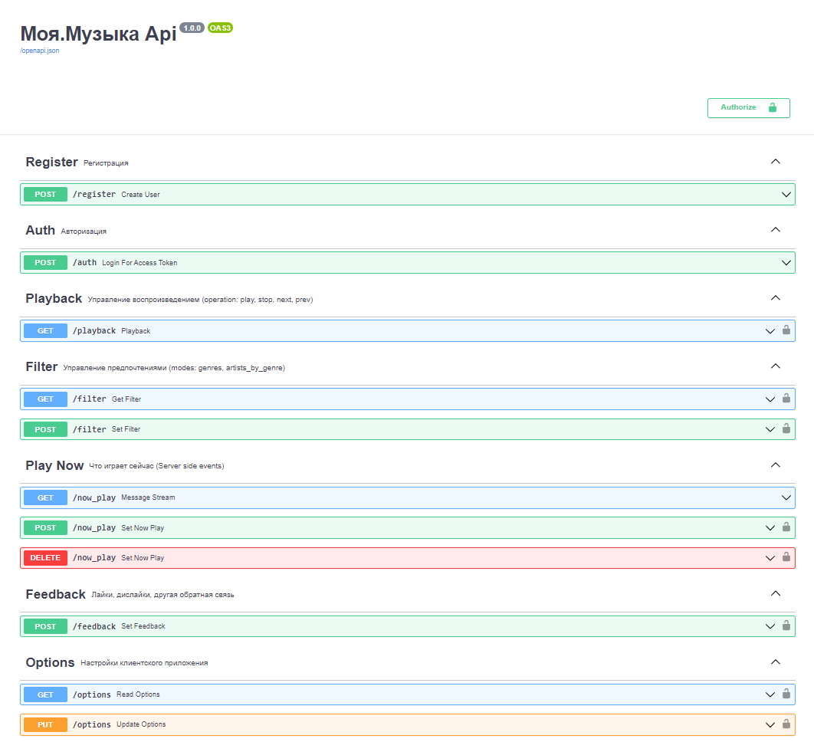

# Моя.Музыка

Backend стримингового сервиса "Моя.Музыка".
Используется FastApi, MongoDB, icecast2/ezstream.
Поток на основе лайков и интересов пользователя, рекомендации на основе любимых жанров, исполнителей, эпох, выбранного настроения. Возможность настройки качества трансляции независимо каждым пользователем.

Реализованы:
- регистрация и авторизация, демо-режим
- управление воспроизведением
- лайк/дислайк, выбор жанра/эпохи/настроения
- избранное (любимые исполнители/жанры)
- автоотключение при отключении клиента
- реверс-прокси для icecast2
- server side events для обновления информации на клиенте о проигрываемом треке
- управление нормализацией громкости
- возможность настройки качества трансляции
- консольная утилита mm_cli для создания/синхронизации БД с метаинформацией

Frontend здесь https://github.com/darkavengersmr/MyMusicUI

